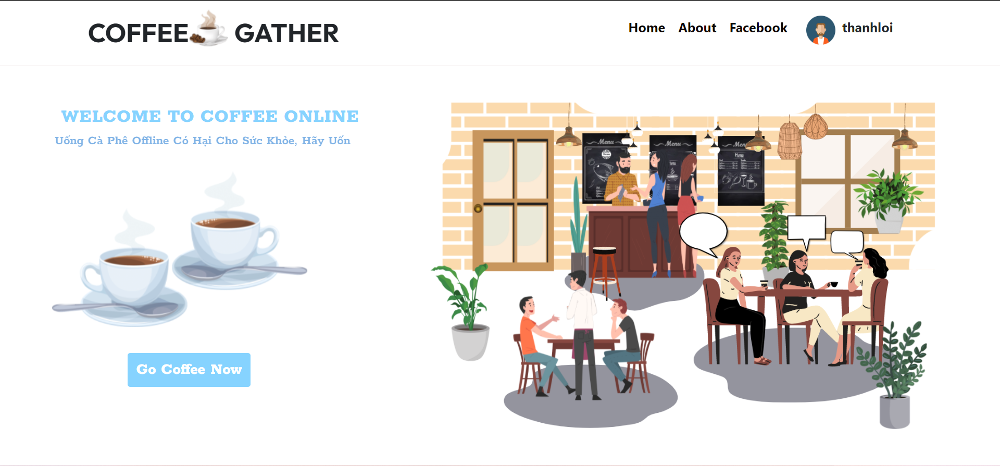
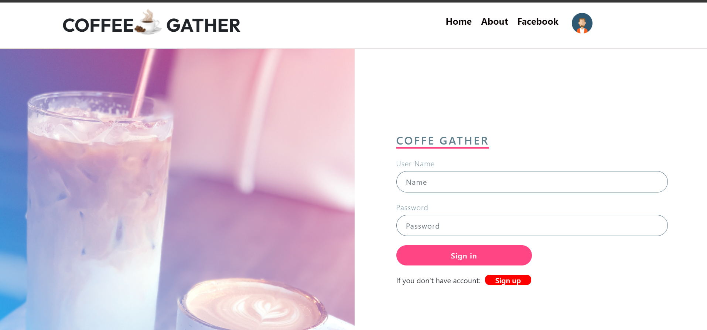
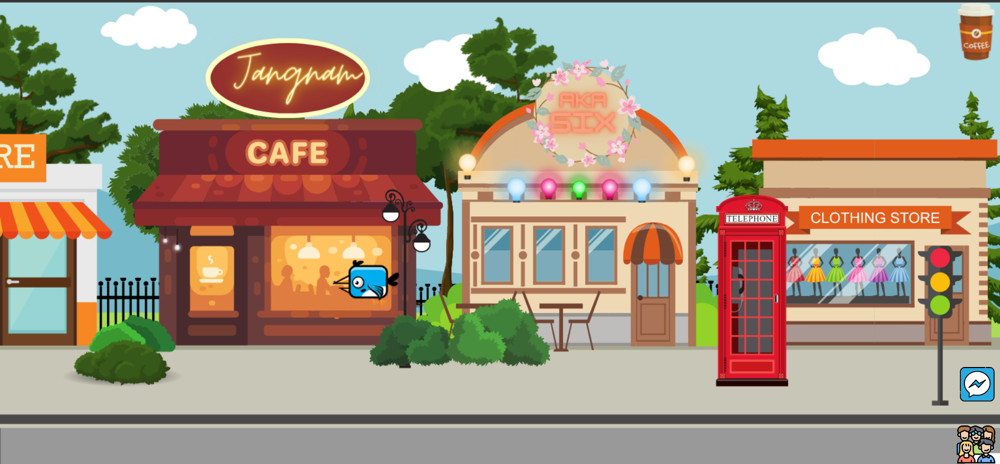
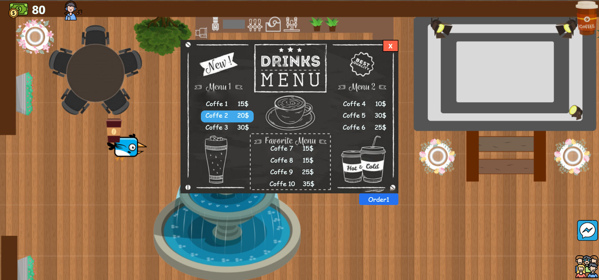
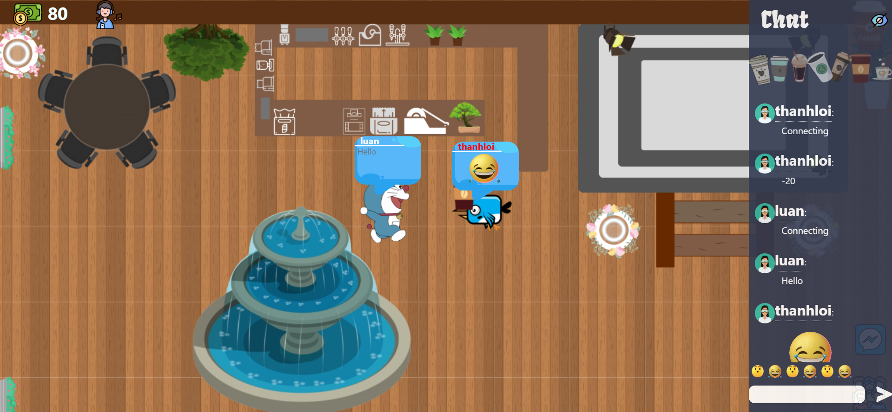
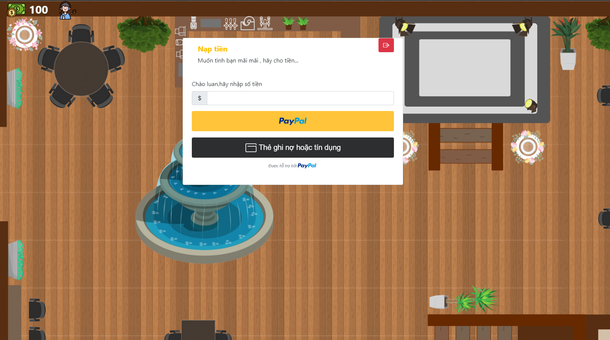

# Gatther Coffee
## _The Last Markdown Editor, thanhloiuit (alias LNOI )_

## Introduce
- Web application helps people connect with each other through the internet,interact like chat, explore virtual cafe space,…
- Can order coffee, pay with paypal, make friends, move character 2d 

## Tech
- [python3] programming language to code backend
- [Django] framework to code
- [sqlite3] database
- [HTML,CSS] front end
- [redis-server] 

## Installation with docker-compose on Ubuntu 20.4 

Web requires version[docker]>= 20.10.17 and version[docker-compose] >= 1.27.0
```sh
sudo su
git clone https://github.com/LNOI/GatherCoffee
cd GatherCoffee
docker-compose up --build
http://127.0.0.1:8000
```

## Image related to Gather Coffee

View Home


View Login


View Choose Character


View Lobby


View Order coffee


View Order communication


View Order Paypal



